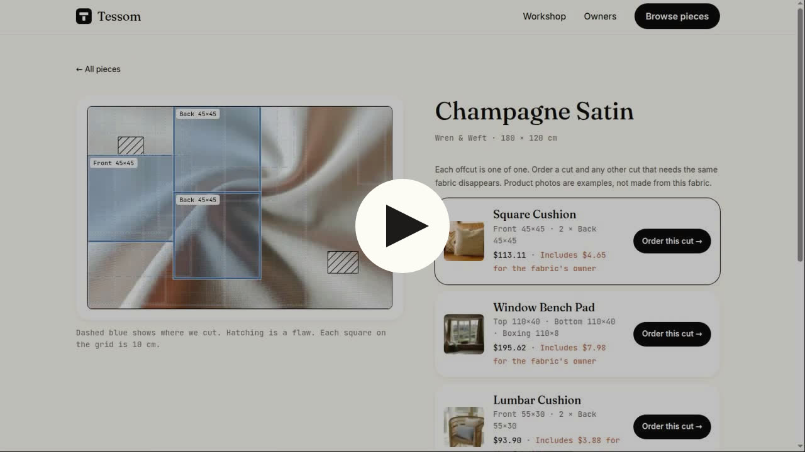
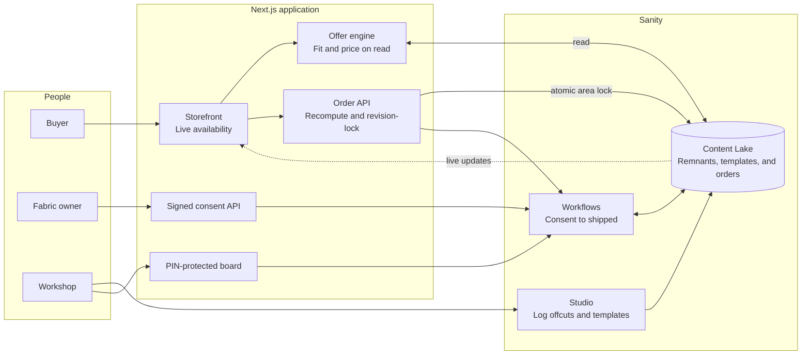
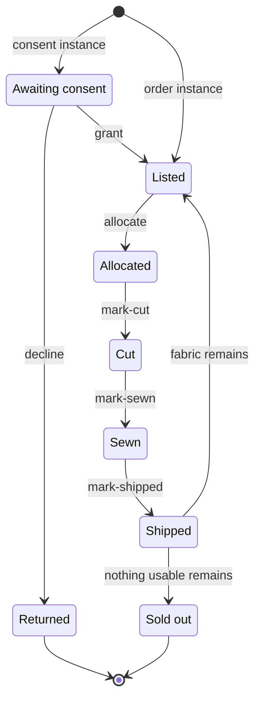

# Tessom

Every offcut has a next piece. Leftover upholstery fabric, cut into one-off cushions, pads and totes. The schema decides what is for sale.

[](https://github.com/mystiquemide/tessom/actions/workflows/ci.yml)

[](https://youtu.be/HU9j5eTUA84)

| | |
|---|---|
| Live site | https://tessom.midelabs.xyz |
| Demo video | https://youtu.be/HU9j5eTUA84 |
| Sanity project ID | `59g78icb` |
| Dataset | `production` (public read) |
| DEV post | https://dev.to/mystiquemide/tessom-every-upholstery-offcut-gets-a-next-piece-4nim |

Built for the DEV x Sanity Challenge.

## Try it in 60 seconds

Workshop PIN for the live site: `tessom-judges-2026`

1. Open `/shop` and pick a fabric. Hover a cut and the plan redraws it on the real photo.
2. Open the same piece in a second window, side by side. Order a cut in one. The other window updates by itself, with no reload: the sold area is stamped and the competing cuts disappear. Try ordering the same cut in both and one is refused.
3. Open `/workshop`, enter the PIN, and move your order along: cut, sewn, shipped. The buyer's page at `/order/[id]` follows.
4. On the board, open the Awaiting consent column and press Copy owner link. Open it, and approve or decline the offcut. That is the Workflows consent stage.
5. Open `/submit` and offer a fabric with a photo. In `/workshop`, the new offer appears under Offered fabric. Press Read selvage photo to fill in the name, maker and repeat from the printed selvage, then enter a value and press Accept. It joins Awaiting consent with its own owner link, and the submitter's `/offer/[reference]` page shows Accepted.
6. Query the live data yourself. See the two queries below.

## Where to look for each judging criterion

| Criterion | Where |
|---|---|
| App functionality | The 60-second flow above, plus Studio's review-before-apply selvage extraction. Every step runs against the live Sanity project |
| Schema thoughtfulness | [Schema](#schema) and [Why the schema looks like this](#why-the-schema-looks-like-this) |
| Workflows bonus | [Workflow](#workflow). Consent, allocation and production are real stages, with an allocation guard and a dedicated Studio Workflows view |
| Creativity | The cut plan: dashed panels drawn on the real fabric photo, with flaws kept clear |
| Build process | [What broke, and how I fixed it](#what-broke-and-how-i-fixed-it), and the tests that pin each fix |

## How it works



A workshop logs an offcut with its size, pattern repeat, direction, flaws and a photo. The owner says yes before it is listed. On every read, the offer engine fits each product pattern onto the free fabric and prices the fit. Offers are never stored, so nothing can go stale. An order locks the exact area it uses, so every other cut that needs it disappears.

Anyone with leftover fabric can offer it at `/submit`: size, a photo, and optional details. The offer is stored on a private path with the contact encrypted, and nothing is listed. The submitter gets a private status page. The workshop reviews the offer on the board, can read the selvage photo with Groq Vision to pre-fill the fabric name, maker, repeat and direction, checks the fields, sets a value and accepts. That creates the remnant and starts its consent workflow. The fabric then appears under a generic owner name, never the submitter's name or email.

Studio adds two workshop tools. The Workflows view shows every deployed definition and live instance as a table or board. On a remnant document, **Read selvage photo** sends its Sanity image to Groq Vision and suggests the printed fabric name, maker, repeat and direction. The editor sees the evidence and confidence first, and nothing changes until they press **Apply suggestions**. Missing details stay untouched instead of being guessed.

## Schema

| Type | Holds |
|---|---|
| `owner` | name, email, kind (client, designer, workshop), `shareBps` |
| `remnant` | title, fabric (name, maker, value per metre), size, `repeat`, `directional`, `defects[]`, photo, `owner`, `status`, `allocations[]` |
| `productTemplate` | name, kind, `pieces[]` (label, size, quantity), `seamCm`, `labourMin`, `fillCost`, image |
| `submission` | size, photo, notes, `kind`, `status` (new, accepted, declined), `contact` (encrypted). Private path, reviewed by the workshop before any remnant exists |
| `order` | `remnant`, `template`, `placement[]`, price, `ownerShare`, `buyerContact` (encrypted), `workflowInstanceId` |

The remnant owns its allocations, so what is sold lives in one place. Orders use a private ID path, so the public dataset returns none of them.

Paste these into a terminal, or open `/studio` and run them in the Vision tab:

```sh
# Every offcut, its owner, and how many areas are already sold
curl -s -G 'https://59g78icb.api.sanity.io/v2025-02-19/data/query/production' \
  --data-urlencode 'query=*[_type=="remnant"]{title,status,"owner":owner->name,"areasSold":count(allocations)}'

# Every workflow instance and the stage it is in
curl -s -G 'https://59g78icb.api.sanity.io/v2025-02-19/data/query/production' \
  --data-urlencode 'query=*[_type=="sanity.workflow.instance"]{_id,currentStage}'
```

Orders are not readable without a token:

```sh
curl -s -G 'https://59g78icb.api.sanity.io/v2025-02-19/data/query/production' \
  --data-urlencode 'query=*[_type=="order"]'
```

## Why the schema looks like this

| Decision | Why |
|---|---|
| Allocations live on the remnant | What is sold has one source of truth. The offer engine reads it, and the order route writes it with the remnant's revision, so two buyers cannot both win |
| Offers are computed on read, never stored | A stored offer can go stale the moment another order lands. Computing it means a sold area simply stops being offered |
| Consent is a workflow stage, not a boolean | Whose permission a piece needs, and when it was given, is the Workflows story. It also means the shop cannot list an unconsented piece |
| The workflow guard and the area lock check the same thing | Two sources of truth would disagree in front of a judge |
| Orders use a private ID path and an encrypted contact | The dataset is public. The public API returns no orders, and the buyer's name and email are ciphertext |
| A public fabric offer never becomes a listing on its own | Offers sit on a private path and the contact is ciphertext. Accepting creates the owner under a pseudonym such as Client 3fa9, so the public dataset never holds the submitter's name or email |
| The server recomputes every offer on order | The request carries only IDs and a fingerprint. Geometry and price are never taken from the client |

## Workflow



| Action | Fired by | How it is authorised |
|---|---|---|
| `grant`, `decline` | The fabric's owner | A private link signed for that owner |
| `allocate` | A buyer placing an order | The order API recomputes the offer, then locks the area |
| `mark-cut`, `mark-sewn`, `mark-shipped` | The workshop | The workshop PIN |

Two orders for the same cut, fired at the same moment against the live dataset:

```
request 1 -> HTTP 409  {"error": "The remnant changed while the order was being placed"}
request 2 -> HTTP 200  {"orderId": "orders.c878c437725fbf72", "remnantId": "remnant-09", "templateId": "template-01", "price": 113.11, "ownerShare": 4.65}
```

The winner's panels become sold areas on the remnant (`areasSold: 3`). The loser leaves no workflow instance behind.

Sanity Workflows 0.36 has no background runtime, so every route that changes data advances the workflow itself. The allocation guard and the area lock check the same thing, so they cannot disagree.

## 19 ways I tried to break it

The suite has 302 tests across 38 files.

| Attempt | Outcome | Proof |
|---|---|---|
| Rotate pieces on a directional fabric | Refused | [offers.test.ts](tests/offers/offers.test.ts) |
| Cut over a flaw or an area already sold | Never offered | [offers.test.ts](tests/offers/offers.test.ts) |
| Ignore the pattern repeat | Panels snap to repeat multiples, or the offer is dropped | [offers.test.ts](tests/offers/offers.test.ts) |
| Price an offer below the margin floor | Offer dropped | [offers.test.ts](tests/offers/offers.test.ts) |
| Two buyers, same area | One order, one conflict | [order-service.test.ts](tests/orders/order-service.test.ts) |
| Retry a checkout | The same key replays the same order | [order-service.test.ts](tests/orders/order-service.test.ts) |
| Read a buyer's contact from the dataset | Encrypted, fresh IV per order | [orders.test.ts](tests/sanity/orders.test.ts) |
| Move an order without the PIN | 401, and a lockout after ten wrong tries | [workflow-advance-route.test.ts](tests/api/workflow-advance-route.test.ts) |
| Decide consent with another owner's link | 401 | [owner-consent-route.test.ts](tests/api/owner-consent-route.test.ts) |
| Find a contact on the buyer order page | None is returned | [order-status.test.ts](tests/order-status.test.ts) |
| Re-seed over live orders | Refused without an explicit override | [seed.test.ts](tests/sanity/seed.test.ts) |
| Upload a script renamed to .jpg as fabric | Refused by the file's own bytes, nothing stored | [submissions-route.test.ts](tests/api/submissions-route.test.ts) |
| Fill the offer form with a bot | The hidden field is filled, so nothing is stored and the bot learns nothing | [submissions-route.test.ts](tests/api/submissions-route.test.ts) |
| Guess an offer reference, or look for a contact on the status page | A 16-character random reference, and the page carries no contact, photo or internal ID | [status.test.ts](tests/submissions/status.test.ts) |
| Read a selvage from an image the workshop never accepted | The reader runs only on a stored offer's own photo, behind the PIN, and changes nothing until Accept | [workshop-submissions-routes.test.ts](tests/api/workshop-submissions-routes.test.ts) |
| Accept the same fabric offer twice | 409, one remnant | [workshop-submissions-routes.test.ts](tests/api/workshop-submissions-routes.test.ts) |
| Find the submitter's name or email in the public data | Private path, ciphertext, pseudonymous owner | [workshop-submissions-routes.test.ts](tests/api/workshop-submissions-routes.test.ts) |
| Send an arbitrary URL to the fabric extractor | Refused before Groq is called | [fabric-extraction-route.test.ts](tests/api/fabric-extraction-route.test.ts) |
| Show the extractor a photo without readable selvage | Unknown fields stay null instead of being invented | [fabric-extraction.test.ts](tests/groq/fabric-extraction.test.ts) |

## Run locally

```sh
git clone https://github.com/mystiquemide/tessom && cd tessom
npm install
cp .env.example .env.local
npm run test:run
npm run dev
```

Browsing the shop needs no secrets. Orders, the workshop board and the owner pages need a write token for your own Sanity project. Selvage extraction also needs a Groq API key.

| Variable | Purpose |
|---|---|
| `NEXT_PUBLIC_SANITY_PROJECT_ID`, `NEXT_PUBLIC_SANITY_DATASET` | Which Sanity dataset to use |
| `NEXT_PUBLIC_WORKFLOW_TAG`, `WORKFLOW_TAG` | Matching public Studio and server workflow namespaces, for example `tessom-dev` |
| `SANITY_API_WRITE_TOKEN` | Server-side writes. Never sent to the browser |
| `GROQ_API_KEY` | Server-side Groq Vision access for explicit selvage extraction |
| `ORDER_ENCRYPTION_KEY` | 32 random bytes in base64. Encrypts buyer contacts and signs owner links |
| `WORKSHOP_PIN` | At least 12 characters. Unlocks `/workshop` |
| `NEXT_PUBLIC_SITE_URL` | Public address, used for the share preview |
| `ALLOW_PRODUCTION_SEED`, `ALLOW_DESTRUCTIVE_SEED` | Deliberate overrides the seed script requires |

To set up your own project, run `npm run schema:deploy`, `npm run wf:deploy`, `npm run seed` and `npm run wf:bootstrap`. The seed does not carry photos. To add them, set `UNSPLASH_ACCESS_KEY` and run `npx tsx scripts/attach-photos.ts`.

## What broke, and how I fixed it

| What broke | How I found it | Fix |
|---|---|---|
| Fabric photo search returned ferns, CGI renders and real sand for fabric names | Reviewing contact sheets of every candidate | Renamed seven fabrics to match photos that really are textiles, instead of captioning a plant as a fabric |
| A template with no `labourMin` or `fillCost` silently produced no offer | A test fixture failed in a way that looked like a geometry bug | The engine prices only complete templates. Fixtures now carry both fields |
| The seed script does not delete orders or workflow instances | A reseed left old orders on the board | Remnants reference their orders, so the reset order matters: reseed first, then delete orders and instances, then rebuild the consent instances |
| A global `margin: 0` on headings overrode Tailwind spacing | An error page's headline sat off-centre | Removed the rule. Unlayered CSS beats utility classes |
| Adding loading skeletons made unknown pieces return HTTP 200 | Checking status codes after the change | Kept the skeletons. Those pages carry a noindex tag, and URLs that match no route still return 404 |
| My own UX audit found muted text at 3.65 to 4.06:1 contrast, no `<main>` on two pages, no security headers and an unthrottled order endpoint | A full browser audit at two widths | Darkened the muted colour, one `<main>` per page, headers and CSP, rate limits on orders and wrong PINs. Re-ran the audit: zero contrast failures |
| The first Vercel deploy failed with `No Output Directory named "dist"` | The build log | The build had passed. The project had no framework preset. Set it to Next.js and redeployed |

## Limitations

- No payments and no email. An order reserves the cut. The workshop reads the buyer's contact on its board and arranges payment and shipping by hand.
- Offering fabric stores a submission and tells the submitter nothing by email. The workshop reads the contact when it accepts and sends the owner link by hand. The upload limit is 3 MB per photo, and the per-address rate limit is in memory.
- Rectangles only. There is no irregular-shape nesting.
- The workshop uses one shared PIN. Wrong tries are rate-limited per address in memory, which slows a script on one server but is not shared across instances.
- Owner links have no expiry. Rotating `ORDER_ENCRYPTION_KEY` revokes them all, and also makes stored buyer contacts unreadable.
- Owner pages are public, so anyone can see each owner's accrued earnings. Owner emails sit in the public dataset. The seed data uses `example.com` addresses.
- The catalog is sample data. The 12 offcuts, 6 owners and fabric makers are invented. The photos are real, from Unsplash. Groq Vision is used only when an editor explicitly asks Studio to read visible selvage details.
- Selvage extraction needs a clear photo of printed manufacturer details. Every suggestion requires editor review and can be left unapplied.
- Sanity Workflows is early access (0.36).
- Unaudited hackathon code. Do not point it at real customers or payments.

## Credits

Fabric and product photographs are from [Unsplash](https://unsplash.com), used under the Unsplash License. Photographers:

- [Anna Kharkivska](https://unsplash.com/photos/two-chairs-and-a-small-table-on-wooden-floor-QBRHpMT2sD8)
- [Art Institute of Chicago](https://unsplash.com/photos/a-blue-and-white-floral-pattern-on-a-gray-background-_yEfDp-rtLI)
- [Darrell Jonathan](https://unsplash.com/photos/a-close-up-of-a-bed-with-a-yellow-bedspread-E9RC7yIWeA8)
- [Deconovo](https://unsplash.com/photos/brown-wicker-armchair-with-gray-throw-pillow-YckKVuyey-4)
- [Europeana](https://unsplash.com/photos/diagonal-pattern-of-brown-and-beige-batik-fabric-6qNaCfKp_gc)
- [Giorgio Trovato](https://unsplash.com/photos/a-blue-bag-sitting-on-top-of-a-white-chair-E5M98Nox2JA)
- [Kaiyu Wu](https://unsplash.com/photos/orange-textile-PkTvSZe6rcg)
- [Lucas de Moura](https://unsplash.com/photos/a-brown-couch-with-two-pillows-on-it-b0kTwnDM1O0)
- [Mitchell Luo](https://unsplash.com/photos/green-textile-in-close-up-image-8acRvqOAjpw)
- [Moonstarious Project](https://unsplash.com/photos/a-close-up-of-a-blue-fabric-on-a-white-surface-QXuFCRq8rcQ)
- [Rick Rothenberg](https://unsplash.com/photos/a-blue-and-black-wall-with-a-pattern-on-it-Ts_f_hGlgOE)
- [Rob Wingate](https://unsplash.com/photos/window-curtain-open-wide-Fd9tUmRBJzk)
- [Smithsonian](https://unsplash.com/photos/pink-background-with-vertical-red-and-white-patterned-stripes-WWdLd0gemgs)
- [The Cleveland Museum of Art](https://unsplash.com/photos/a-close-up-of-a-green-and-white-rug--B6iItEAKVE)
- [antipillingfabric manufacturers](https://unsplash.com/photos/a-close-up-view-of-a-white-fabric-W_lQogTM6Os)

Built with Next.js, Sanity (Studio, Content Lake and Workflows), Groq Vision, Tailwind CSS, Zod and Vitest. Type is Fraunces, Inter, JetBrains Mono and Grenze Gotisch, all under the SIL Open Font License. The Sanity mark comes from Simple Icons.

## License

MIT. See [LICENSE](LICENSE).
