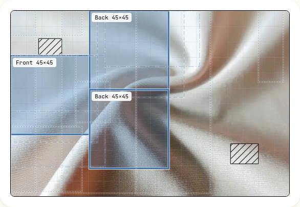

# Tessom

Every offcut has a next piece. Leftover upholstery fabric, cut into one-off cushions, pads and totes. The schema decides what is for sale.



| | |
|---|---|
| Live site | https://tessom.midelabs.xyz |
| Sanity project ID | `59g78icb` |
| Dataset | `production` (public read) |
| DEV post | Pending |

Built for the DEV x Sanity Challenge.

## Try it in 60 seconds

Workshop PIN for the live site: `tessom-judges-2026`

1. Open `/shop` and pick a fabric. Hover a cut and the plan redraws it on the real photo.
2. Open the same piece in a second tab. Order the same cut in both. One order is accepted and the other gets a conflict.
3. Open `/workshop`, enter the PIN, and move your order along: cut, sewn, shipped. The buyer's page at `/order/[id]` follows.
4. On the board, open the Awaiting consent column and press Copy owner link. Open it, and approve or decline the offcut. That is the Workflows consent stage.
5. Query the live data yourself. See the two queries below.

## How it works

```
Sanity Studio -> Content Lake -> offer engine -> storefront -> Workflows
 (log offcuts)   (public data)   (fits + prices)   (/shop)     (consent to shipped)
```

A workshop logs an offcut with its size, pattern repeat, direction, flaws and a photo. The owner says yes before it is listed. On every read, the offer engine fits each product pattern onto the free fabric and prices the fit. Offers are never stored, so nothing can go stale. An order locks the exact area it uses, so every other cut that needs it disappears.

## Schema

| Type | Holds |
|---|---|
| `owner` | name, email, kind (client, designer, workshop), `shareBps` |
| `remnant` | title, fabric (name, maker, value per metre), size, `repeat`, `directional`, `defects[]`, photo, `owner`, `status`, `allocations[]` |
| `productTemplate` | name, kind, `pieces[]` (label, size, quantity), `seamCm`, `labourMin`, `fillCost`, image |
| `order` | `remnant`, `template`, `placement[]`, price, `ownerShare`, `buyerContact` (encrypted), `workflowInstanceId` |

The remnant owns its allocations, so what is sold lives in one place. Orders use a private ID path, so the public dataset returns none of them.

Paste these into a terminal:

```sh
# Every offcut, its owner, and how many areas are already sold
curl -s -G 'https://59g78icb.api.sanity.io/v2025-02-19/data/query/production' \
  --data-urlencode 'query=*[_type=="remnant"]{title,status,"owner":owner->name,"areasSold":count(allocations)}'

# Every workflow instance and the stage it is in
curl -s -G 'https://59g78icb.api.sanity.io/v2025-02-19/data/query/production' \
  --data-urlencode 'query=*[_type=="sanity.workflow.instance"]{_id,currentStage}'
```

Orders are not readable without a token:

```sh
curl -s -G 'https://59g78icb.api.sanity.io/v2025-02-19/data/query/production' \
  --data-urlencode 'query=*[_type=="order"]'
```

## Workflow

```
awaiting-consent --grant--> listed --allocate--> allocated --mark-cut--> cut
       |                       ^                                           |
    decline                    |                                      mark-sewn
       v                       |                                           v
    returned            (fabric left over)   <--- shipped <--mark-shipped-- sewn
                                                     |
                                                     +--> sold-out (nothing left)
```

| Action | Fired by | How it is authorised |
|---|---|---|
| `grant`, `decline` | The fabric's owner | A private link signed for that owner |
| `allocate` | A buyer placing an order | The order API recomputes the offer, then locks the area |
| `mark-cut`, `mark-sewn`, `mark-shipped` | The workshop | The workshop PIN |

Sanity Workflows 0.36 has no background runtime, so every route that changes data advances the workflow itself. The allocation guard and the area lock check the same thing, so they cannot disagree.

## 11 ways I tried to break it

The suite has 249 tests across 30 files.

| Attempt | Outcome | Proof |
|---|---|---|
| Rotate pieces on a directional fabric | Refused | [offers.test.ts](tests/offers/offers.test.ts) |
| Cut over a flaw or an area already sold | Never offered | [offers.test.ts](tests/offers/offers.test.ts) |
| Ignore the pattern repeat | Panels snap to repeat multiples, or the offer is dropped | [offers.test.ts](tests/offers/offers.test.ts) |
| Price an offer below the margin floor | Offer dropped | [offers.test.ts](tests/offers/offers.test.ts) |
| Two buyers, same area | One order, one conflict | [order-service.test.ts](tests/orders/order-service.test.ts) |
| Retry a checkout | The same key replays the same order | [order-service.test.ts](tests/orders/order-service.test.ts) |
| Read a buyer's contact from the dataset | Encrypted, fresh IV per order | [orders.test.ts](tests/sanity/orders.test.ts) |
| Move an order without the PIN | 401, and a lockout after ten wrong tries | [workflow-advance-route.test.ts](tests/api/workflow-advance-route.test.ts) |
| Decide consent with another owner's link | 401 | [owner-consent-route.test.ts](tests/api/owner-consent-route.test.ts) |
| Find a contact on the buyer order page | None is returned | [order-status.test.ts](tests/order-status.test.ts) |
| Re-seed over live orders | Refused without an explicit override | [seed.test.ts](tests/sanity/seed.test.ts) |

## Run locally

```sh
git clone https://github.com/mystiquemide/tessom && cd tessom
npm install
cp .env.example .env.local
npm run test:run
npm run dev
```

Browsing the shop needs no secrets. Orders, the workshop board and the owner pages need a write token for your own Sanity project.

| Variable | Purpose |
|---|---|
| `NEXT_PUBLIC_SANITY_PROJECT_ID`, `NEXT_PUBLIC_SANITY_DATASET` | Which Sanity dataset to use |
| `SANITY_API_WRITE_TOKEN` | Server-side writes. Never sent to the browser |
| `ORDER_ENCRYPTION_KEY` | 32 random bytes in base64. Encrypts buyer contacts and signs owner links |
| `WORKSHOP_PIN` | At least 12 characters. Unlocks `/workshop` |
| `WORKFLOW_TAG` | Names the workflow set, for example `tessom-dev` |
| `NEXT_PUBLIC_SITE_URL` | Public address, used for the share preview |
| `ALLOW_PRODUCTION_SEED`, `ALLOW_DESTRUCTIVE_SEED` | Deliberate overrides the seed script requires |

To set up your own project, run `npm run schema:deploy`, `npm run wf:deploy`, `npm run seed` and `npm run wf:bootstrap`.

## Limitations

- No payments and no email. An order reserves the cut. The workshop reads the buyer's contact on its board and arranges payment and shipping by hand.
- Rectangles only. There is no irregular-shape nesting.
- The workshop uses one shared PIN. Wrong tries are rate-limited per address in memory, which slows a script on one server but is not shared across instances.
- Owner links have no expiry. Rotating `ORDER_ENCRYPTION_KEY` revokes them all, and also makes stored buyer contacts unreadable.
- Owner pages are public, so anyone can see each owner's accrued earnings. Owner emails sit in the public dataset. The seed data uses `example.com` addresses.
- The catalog is sample data. The 12 offcuts, 6 owners and fabric makers are invented. The photos are real, from Unsplash. There is no AI in Tessom.
- Sanity Workflows is early access (0.36).
- Unaudited hackathon code. Do not point it at real customers or payments.

## License

MIT. See [LICENSE](LICENSE).
